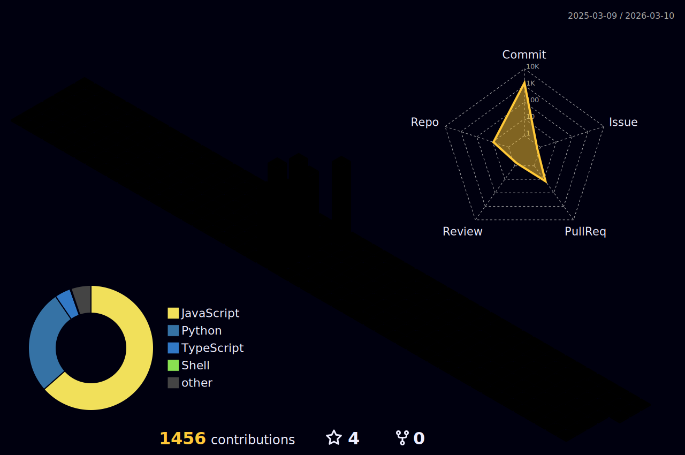

# 👋 Hi, I'm Akshay Verma  

🤖 **Bot Developer | Full-Stack & AI Enthusiast | Automation & Open Source Contributor**  

---

## 🌈 About Me  

I’m **Akshay Verma**, a passionate **Bot Developer, Full-Stack Developer, and AI Enthusiast** with a strong focus on building automation solutions, intelligent applications, and scalable systems.  

💼 **Professional Interests:**  
- Designing and developing **Telegram, Discord & Instagram bots** with real-world use cases  
- Exploring **AI, Machine Learning, and Automation workflows** to create impactful solutions  
- Contributing to **open-source projects** and collaborating with the global developer community  
- Developing **scalable full-stack applications** using modern frameworks and cloud technologies  

🌟 **Core Values & Approach:**  
- **Innovation-Driven:** Transforming complex problems into simple, automated solutions  
- **User-Centric:** Every project focuses on delivering value and enhancing user experience  
- **Continuous Growth:** Constantly learning new technologies and adapting to emerging trends  

📌 My vision is to **leverage AI + Automation + Full-Stack Development** to create technologies that simplify processes, empower individuals, and inspire innovation.  

---

## 🖥️ Languages  

---

## 🛠️ Tech Stack & Tools  

  
  
  
  
  
  
  
  
  
  
  
  
  
  
  

---

## ☁️ Cloud & DevOps Tools

---

## 🏆 GitHub Achievements  

  

---

## 🌟 Featured Bots & Projects  

  
🚀 Click to Expand Projects

  - **SocialPipe Bot** → Multi-social hub bot managing all accounts via Telegram  
  - **AI Chatbot** → Intelligent AI chatbot for Telegram & Discord  
  - **Instagram Auto Bot** → Friendly automation & DM handling bot for Instagram  

---

## 📰 Dev Quotes  

  

---

## 🤣 Dev Jokes  

  

---

## 🎨 3D Contribution Calendar  

 

---

## 📌 Pinned Projects  

  
  

---

## 🛠️ Currently  

  
  
  

---

## 📫 Connect With Me  
### 🌐 Professional Profiles  

---

### 🎉 Social Profiles  

---

## 👀 Visitor Counter  

  

---

## 🎵 Recently Played on Spotify  

  

---

⚡ **Fun Fact:**  
> "I love building bots, web apps, and automation tools that solve real-world problems and make tech fun!" 🤖
